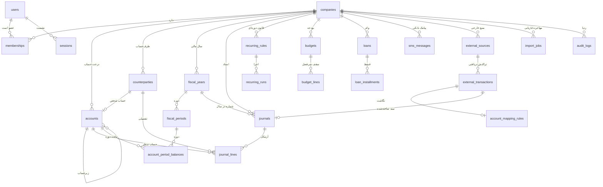

# سند طراحی مدل داده — نرم‌افزار حسابداری تحت وب

| مشخصه | مقدار |
|---|---|
| نسخه سند | ۰.۲ (**تأییدشده** — مبنای ساخت اسکیمای فاز ۰) |
| تاریخ | ۲۳ شهریور ۱۴۰۵ (2026-09-14) |
| سند بالادستی | `PRD.md` نسخه ۰.۳ (تأییدشده) |
| موتور هدف | PostgreSQL (تک‌موتوره) + ORM (Prisma) + مهاجرت SQL برای تریگرها/قیدها |
| وضعیت | ✅ تأیید کارفرما در ۱۴۰۵/۰۶/۲۳ |
| تصمیم‌های قطعی‌شدهٔ این نسخه | واحد نمایش مبلغ = **ریال** • لینک کیف پول = **یک‌طرفه (INBOUND)** • تأیید پیش‌فرض‌های ۱ تا ۴ |

> **هدف این سند:** مشخص کردن موجودیت‌ها، فیلدها، روابط، قواعد یکپارچگی، استراتژی شماره‌گذاری اسناد،
> استراتژی محاسبهٔ مانده‌ها، و سناریوهای کلیدی (ثبت ساده، فاکتور، چک، لینک کیف پول، بستن دوره) —
> به‌گونه‌ای که **فاز ۲ و ۳ و ۴ بدون بازنویسی اسکیما** روی همین پایه سوار شوند.

---

## ۰. پیش‌فرض‌های اعمال‌شده (از تصمیم‌های PRD)

هر چهار پیش‌فرض زیر در تاریخ **۱۴۰۵/۰۶/۲۳ توسط کارفرما تأیید شد** و از این پس **قطعی** است (بند ۱۳ فقط برای مستندسازی اثر تغییرهای احتمالیِ آینده نگه داشته شده).

| # | پیش‌فرض | اثر در این سند |
|---|---|---|
| ۱ ✅ | موتور **سندمحور (دوبل‌انتری)** از روز اول | همهٔ رویدادهای مالی به `journals` + `journal_lines` ختم می‌شوند |
| ۲ ✅ | **Postgres تک‌موتوره** + ORM کامل | استفاده از تریگر، RLS، ایندکس ترکیبی، `generated column` |
| ۳ ✅ | مبالغ = **عدد صحیح ریالی (BIGINT)** + نمایش **ریال** | هیچ `float`/`double` در ستون پول وجود ندارد |
| ۴ ✅ | احراز هویت **نشست امن سمت سرور** + نقش‌ها | جدول `sessions` و `memberships` با نقش enum و جای نقش سفارشی |

---

## ۱. اصول طراحی (قواعد سراسری)

این قواعد بر **همهٔ** جداول اعمال می‌شوند و در بازبینی کد به‌عنوان چک‌لیست استفاده می‌شوند.

1. **کلید اصلی:** `id UUID` (نسخه ۴) برای همهٔ جداول.
   دلیل: جلوگیری از شماره‌گذاری قابل‌حدس (enumeration) در API، عدم وابستگی به sequence در محیط serverless، امکان تولید شناسه در لایهٔ اپلیکیشن.
2. **چندمجموعه‌پذیری از روز اول:** هر جدول مالی ستون `company_id UUID NOT NULL` دارد و **همهٔ** ایندکس‌های مهم با `company_id` شروع می‌شوند.
3. **پول:** `BIGINT` بر حسب **ریال**. تبدیل ریال↔تومان فقط در لایهٔ نمایش/ورودی (نه در دیتابیس). هیچ ستون پولی `NULL` نمی‌شود؛ پیش‌فرض `0` ممنوع است و باید صریح نوشته شود.
4. **مقدار منفی ممنوع:** در `journal_lines` فقط `side` (بدهکار/بستانکار) و `amount > 0` ذخیره می‌شود. علامت از `side` و «طبیعت حساب» استخراج می‌شود، نه از عدد منفی.
5. **تاریخ:** ذخیرهٔ تاریخ میلادیِ مدنی (`DATE`) به‌عنوان حقیقت اصلی + سه ستون `jalali_year/jalali_month/jalali_day` (توسط اپلیکیشن، با تابع قطعی) برای پرس‌وجو و ایندکس‌گذاری شمسی.
   دلیل: همهٔ گزارش‌ها، دوره‌های مالی و بودجه‌ها شمسی‌اند؛ ایندکس روی `(company_id, jalali_year, jalali_month)` سریع و ساده است.
6. **حذف منطقی:** موجودیت‌های مالی `deleted_at TIMESTAMPTZ NULL` دارند. سند **ثبت‌شده** هرگز حذف فیزیکی یا منطقی نمی‌شود (قید در سطح تریگر)؛ اصلاح فقط با سند معکوس/اصلاحی.
7. **ردپا:** هر تغییر روی موجودیت مالی یک رکورد در `audit_logs` می‌سازد (چه کسی، کی، چه چیزی، قبل/بعد).
8. **بدون محاسبه در حافظه:** مانده و گردش یا با تجمیع دیتابیسی (`SUM` + پنجره‌ای) یا از جدول اسنپ‌شات `account_period_balances` خوانده می‌شوند؛ هرگز `SELECT *` روی کل جدول و حلقه در JS.
9. **نام‌گذاری:** نام جدول/ستون همیشه **انگلیسی snake_case** (مطابق `Agents.md`: روی متن فارسی برای مچ‌کردن حساب نمی‌کنیم)؛ برچسب فارسی فقط در لایهٔ UI و فایل ترجمه.
10. **کلید خارجی مالی:** `ON DELETE RESTRICT` (نه CASCADE). حذف یک حساب/طرف‌حساب که گردش دارد باید در سطح اپلیکیشن هم رد شود.
11. **کمیت‌ها (انبار/تولید):** `NUMERIC(18,4)` — چون برخلاف پول، کمیت می‌تواند کسری باشد (کیلو، متر).
12. **بدون ستون چندارزی در نسخهٔ ۱:** مسیر افزودن آن در بند ۱۲ توضیح داده شده (مهاجرت افزایشی و بدون شکستن).

---

## ۲. نقشهٔ کلی موجودیت‌ها



**قاعدهٔ طلایی در این نقشه:** هر پیکانِ «سند ساخته‌شده» در نهایت به `journals` می‌رسد.
تراکنش ساده، اجرای دوره‌ای، پیامک، لینک کیف پول، فاکتور، چک و تولید — همه فقط **مولد سند** هستند، نه یک مدل موازی.

---

## ۳. فاز ۰ — زیرساخت، امنیت و چندکاربره

### ۳.۱ `companies` (مجموعه)
| ستون | نوع | قید/توضیح |
|---|---|---|
| `id` | UUID | PK |
| `name` | VARCHAR(200) | NOT NULL — نام نمایشی |
| `legal_name` | VARCHAR(300) | NULL — نام رسمی (فاز ۲/۳) |
| `national_id` | VARCHAR(20) | NULL، UNIQUE (سراسری، partial) |
| `economic_code` | VARCHAR(20) | NULL (ارزش افزوده، فاز ۲) |
| `base_unit` | VARCHAR(10) | NOT NULL DEFAULT `'RIAL'` — واحد **نمایش**؛ تصمیم قطعی کارفرما (۱۴۰۵/۰۶/۲۳): **ریال**. `TOMAN` فقط به‌عنوان امکان آینده در همین تنظیم باقی می‌ماند |
| `calendar` | VARCHAR(10) | NOT NULL DEFAULT `'JALALI'` |
| `status` | VARCHAR(20) | `ACTIVE`/`ARCHIVED` |
| `owner_user_id` | UUID | FK → users، NOT NULL |
| `created_at` / `updated_at` | TIMESTAMPTZ | NOT NULL DEFAULT now() |

نکته: در MVP یک رکورد «مجموعهٔ پیش‌فرض» ساخته می‌شود و هر کاربر جدید در آن عضو می‌شود؛ فعال‌سازی چندمجموعه‌ای در فاز ۳ فقط یعنی افزودن رکورد و عضویت — **بدون تغییر اسکیما**.

### ۳.۲ `users`
| ستون | نوع | قید/توضیح |
|---|---|---|
| `id` | UUID | PK |
| `email` | CITEXT | UNIQUE (partial: `deleted_at IS NULL`) |
| `phone` | VARCHAR(20) | NULL، UNIQUE partial — ورود با موبایل در آینده |
| `password_hash` | VARCHAR(255) | NOT NULL — Argon2id (پارامترها در `settings`) |
| `display_name` | VARCHAR(120) | NOT NULL |
| `locale` | VARCHAR(10) | NOT NULL DEFAULT `'fa'` |
| `status` | VARCHAR(20) | `ACTIVE`/`LOCKED`/`DISABLED` |
| `failed_login_count` | INT | NOT NULL DEFAULT 0 |
| `locked_until` | TIMESTAMPTZ | NULL — قفل پس از N تلاش ناموفق |
| `password_changed_at` | TIMESTAMPTZ | NULL — برای ابطال نشست‌های قدیمی |
| `last_login_at` | TIMESTAMPTZ | NULL |
| `email_verified_at` | TIMESTAMPTZ | NULL |
| `mfa_secret_enc` | BYTEA | NULL — فاز ۳ |
| `deleted_at` | TIMESTAMPTZ | NULL |
| `created_at`/`updated_at` | TIMESTAMPTZ | NOT NULL |

### ۳.۳ `roles` و `memberships` (نقش و عضویت)
`role_kind` به‌صورت enum در MVP؛ نقش سفارشی دانه‌ای در فاز ۳ با جدول `roles` + `role_permissions` اضافه می‌شود (ستون `role_id` از روز اول موجود و NULL است تا مهاجرت بعدی فقط «پرکردن» باشد).

**`memberships`**
| ستون | نوع | قید/توضیح |
|---|---|---|
| `id` | UUID | PK |
| `company_id` | UUID | FK → companies، NOT NULL |
| `user_id` | UUID | FK → users، NOT NULL |
| `role_kind` | VARCHAR(20) | NOT NULL — `OWNER`/`ACCOUNTANT`/`VIEWER` |
| `role_id` | UUID | NULL — نقش سفارشی (فاز ۳) |
| `is_active` | BOOLEAN | NOT NULL DEFAULT true |
| `invited_by` | UUID | NULL → users |
| `joined_at` | TIMESTAMPTZ | NOT NULL |

قیدها: `UNIQUE(company_id, user_id)` partial روی `is_active`؛ هر مجموعه حداقل یک `OWNER` فعال (تریگر).

**ماتریس دسترسی MVP (منبع حقیقت: تابع `can(user, action, resource)` در کد + همین جدول در سند):**

| توانایی | OWNER | ACCOUNTANT | VIEWER |
|---|:--:|:--:|:--:|
| مشاهدهٔ داشبورد/گزارش/گردش | ✅ | ✅ | ✅ |
| خروجی Excel/PDF | ✅ | ✅ | ❌ |
| ثبت/ویرایش تراکنش دستی | ✅ | ✅ | ❌ |
| ثبت از پیامک و بازبینی آن | ✅ | ✅ | ❌ |
| تعریف بودجه/وام/تراکنش دوره‌ای | ✅ | ✅ | ❌ |
| حذف تراکنش (ایجاد سند اصلاحی) | ✅ | ❌ | ❌ |
| مدیریت حساب‌ها و سرفصل‌ها | ✅ | ✅ (بدون حذف دارای گردش) | ❌ |
| بازیابی بکاپ / مهاجرت داده | ✅ | ❌ | ❌ |
| مدیریت کاربران و نقش‌ها | ✅ | ❌ | ❌ |
| مدیریت منبع خارجی و توکن‌ها | ✅ | ❌ | ❌ |
| بستن/قفل دوره مالی (فاز ۳) | ✅ | ❌ | ❌ |

### ۳.۴ `sessions` (نشست سمت سرور)
| ستون | نوع | توضیح |
|---|---|---|
| `id` | UUID | PK |
| `user_id` | UUID | FK، NOT NULL |
| `token_hash` | VARCHAR(64) | NOT NULL UNIQUE — هش SHA-256 کوکی؛ خود توکن هرگز ذخیره نمی‌شود |
| `company_id` | UUID | NULL — مجموعهٔ فعال این نشست |
| `expires_at` | TIMESTAMPTZ | NOT NULL |
| `revoked_at` | TIMESTAMPTZ | NULL |
| `ip` / `user_agent` | VARCHAR | NULL |
| `created_at` | TIMESTAMPTZ | NOT NULL |

کوکی: `httpOnly` + `secure` + `sameSite=lax`؛ چرخش شناسه پس از ورود موفق (جلوگیری از session fixation).

### ۳.۵ `settings`
`company_id` (NULL = سراسری)، `key`، `value JSONB`، `updated_by`، `updated_at`؛ `UNIQUE(company_id, key)`.
کاربرد: واحد نمایش، درصد هشدار بودجه، پارامترهای Argon2، نسخهٔ پارسر پیامک، سقف rate-limit.

### ۳.۶ `audit_logs`
| ستون | نوع | توضیح |
|---|---|---|
| `id` | UUID | PK |
| `company_id` | UUID | NULL (رویدادهای سراسری مثل LOGIN) |
| `actor_kind` | VARCHAR(12) | `USER`/`SYSTEM`/`EXTERNAL` |
| `actor_user_id` | UUID | NULL |
| `external_source_id` | UUID | NULL — وقتی بازیگر یک منبع خارجی است |
| `action` | VARCHAR(30) | `CREATE`,`UPDATE`,`DELETE`,`POST`,`VOID`,`LOGIN`,`LOGIN_FAILED`,`LOGOUT`,`EXPORT`,`IMPORT`,`RESTORE`,`TOKEN_ISSUED` |
| `entity_type` | VARCHAR(40) | نام جدول/موجودیت |
| `entity_id` | UUID | NULL |
| `before` / `after` | JSONB | NULL — **پس از redaction** |
| `ip` / `user_agent` / `request_id` | VARCHAR | NULL |
| `created_at` | TIMESTAMPTZ | NOT NULL، ایندکس `(company_id, created_at DESC)` |

**Redaction اجباری** (فهرست سیاه در کد + تست): `password_hash`, `token_hash`, `mfa_secret_enc`, `hmac_secret_enc`, `api_token_hash`, و هر کلید شامل `secret`/`token`/`password`. لاگ‌ها فقط‌افزودنی‌اند (بدون UPDATE/DELETE در سطح اپلیکیشن؛ پاک‌سازی فقط با سیاست نگهداری و ثبت در همین لاگ).

---

## ۴. فاز ۰/۱ — موتور مالی (قلب سیستم)

### ۴.۱ `fiscal_years` و `fiscal_periods`
**`fiscal_years`**: `id`, `company_id`, `jalali_year INT NOT NULL`, `title VARCHAR(60)`, `start_date DATE NOT NULL`, `end_date DATE NOT NULL`, `status VARCHAR(12)` (`OPEN`/`CLOSED`/`LOCKED`), `opened_by`, `closed_at`, timestamps.
قیدها: `UNIQUE(company_id, jalali_year)`، `CHECK(start_date < end_date)`، هم‌پوشانی نداشتن بازه‌ها (تریگر).

**`fiscal_periods`**: `id`, `fiscal_year_id`, `company_id`, `period_index SMALLINT` (۱..۱۲), `jalali_year`, `jalali_month`, `start_date`, `end_date`, `status VARCHAR(12)` (`OPEN`/`SOFT_CLOSED`/`LOCKED`), timestamps.
قیدها: `UNIQUE(fiscal_year_id, period_index)`، `UNIQUE(company_id, jalali_year, jalali_month)`.

> `SOFT_CLOSED` (فاز ۱): گزارش‌ها قطعی‌اند ولی ثبت با نقش OWNER مجاز است.
> `LOCKED` (فاز ۳): هیچ ثبت/ویرایشی مجاز نیست — تریگر روی `journals` و `journal_lines`.

### ۴.۲ `accounts` (حساب/سرفصل — درخت چندسطحی)
| ستون | نوع | قید/توضیح |
|---|---|---|
| `id` | UUID | PK |
| `company_id` | UUID | NOT NULL |
| `parent_id` | UUID | NULL → accounts (ریشه = NULL) |
| `path` | VARCHAR(1000) | NOT NULL — مسیر متریالایز مثل `/uuid1/uuid2/` برای پرس‌وجوی زیردرخت |
| `depth` | SMALLINT | NOT NULL DEFAULT 1 — `depth = parent.depth + 1` (تریگر) |
| `account_class` | VARCHAR(12) | NOT NULL — `ASSET`/`LIABILITY`/`EQUITY`/`INCOME`/`EXPENSE` |
| `account_kind` | VARCHAR(20) | NOT NULL — `BANK`/`CASH`/`PERSON`/`INCOME_HEADING`/`EXPENSE_HEADING`/`CONTROL`/`OTHER` |
| `code` | VARCHAR(30) | NULL تا فاز ۳؛ `UNIQUE(company_id, code)` partial |
| `coding_level` | SMALLINT | NULL — ۱ گروه / ۲ کل / ۳ معین / ۴ تفصیلی (فاز ۳) |
| `is_postable` | BOOLEAN | NOT NULL DEFAULT true — فقط حساب برگ/تفصیلی آرتیکل می‌گیرد |
| `name` | VARCHAR(120) | NOT NULL |
| `icon` / `color` | VARCHAR | NULL — UI |
| `is_favorite` | BOOLEAN | NOT NULL DEFAULT false |
| `opening_balance` | BIGINT | NOT NULL DEFAULT 0 — بر حسب ریال، با `opening_side` |
| `opening_side` | VARCHAR(6) | NOT NULL DEFAULT `'DEBIT'` |
| `counterparty_id` | UUID | NULL — برای `PERSON`؛ یک‌به‌یک با طرف‌حساب |
| `bank_name` / `bank_account_no` / `card_no_last4` | VARCHAR | NULL — برای `BANK` (پارسر پیامک از این‌ها استفاده می‌کند) |
| `is_system` | BOOLEAN | NOT NULL DEFAULT false — حساب‌های سیستمی ویرایش/حذف نمی‌شوند |
| `is_active` | BOOLEAN | NOT NULL DEFAULT true |
| `archived_at` / `deleted_at` | TIMESTAMPTZ | NULL |
| `created_by` / `created_at` / `updated_at` | — | NOT NULL |

**قیدها و تریگرها:**
- `UNIQUE(company_id, parent_id, lower(name))` partial (`deleted_at IS NULL`) → **جلوگیری از نام تکراری** هم‌سطح (مطابق PRD).
- تریگر: `is_system = true` → ممنوعیت UPDATE روی `account_class`/`code` و ممنوعیت DELETE.
- تریگر: حذف حساب دارای گردش (وجود `journal_lines`) → `RAISE EXCEPTION` (محافظت از حذف).
- تریگر: `parent_id` نمی‌تواند از زیردرخت خودش باشد (جلوگیری از حلقه با بررسی `path`).
- **طبیعت مانده (normal balance)** ذخیره نمی‌شود؛ از `account_class` مشتق می‌شود تا هرگز ناهم‌تراز نشود:
  `ASSET`,`EXPENSE` → بدهکار؛ `LIABILITY`,`EQUITY`,`INCOME` → بستانکار.
- MVP نمایش دو سطح (ریشه + فرزند) اما اسکیما n-سطحی است؛ `path` + ایندکس `varchar_pattern_ops` پرس‌وجوی زیردرخت را `O(1)` ایندکسی می‌کند.

**حساب‌های سیستمی که برای هر مجموعه خودکار ساخته می‌شوند (seed):**
`صندوق` (CASH/ASSET)، `بانک پیش‌فرض` (BANK/ASSET)، `اشخاص` (PERSON/ASSET ریشه)، `درآمدها` و `هزینه‌ها` (ریشه)،
و در فاز ۲/۳: `حساب دریافتنی تجاری`، `حساب پرداختنی تجاری`، `چک‌های دریافتنی نزد صندوق/بانک`، `چک‌های پرداختنی`، `مالیات بر ارزش افزوده خرید/فروش`، `انبار کالا`، `بهای کالای فروش‌رفته`، `کالای در جریان ساخت`، `سرمایه`، `سود و زیان انباشته`، `خلاصه سود و زیان`.

### ۴.۳ `counterparties` (طرف‌حساب)
`id`, `company_id`, `type VARCHAR(10)` (`NATURAL`/`LEGAL`), `name`, `national_id`, `company_reg_no`, `economic_code`, `phone`, `email`, `address`, `postal_code`, `credit_limit BIGINT NULL`, `payment_terms_days INT NULL`, `linked_account_id UUID NULL`, `is_active`, `notes`, `deleted_at`, timestamps.
قیدها: `UNIQUE(company_id, national_id)` partial؛ `credit_limit` فقط برای `LEGAL`/تجاری معنادار است (فاز ۲).
رابطه: هر طرف‌حساب می‌تواند یک حساب `PERSON` داشته باشد (نگاشت ۱:۱) — این پلِ بین «دفتر شخصی» و «حسابداری تجاری» است.

### ۴.۴ `journals` (سند) — سربرگ
| ستون | نوع | قید/توضیح |
|---|---|---|
| `id` | UUID | PK |
| `company_id` | UUID | NOT NULL |
| `fiscal_year_id` | UUID | NOT NULL |
| `fiscal_period_id` | UUID | NOT NULL |
| `serial_no` | BIGINT | NULL تا زمان ثبت؛ `UNIQUE(company_id, fiscal_year_id, serial_no)` partial |
| `date` | DATE | NOT NULL — تاریخ وقوع/ثبت (میلادی مدنی) |
| `jalali_year`/`jalali_month`/`jalali_day` | SMALLINT | NOT NULL — مشتق قطعی از `date` |
| `description` | VARCHAR(500) | NULL |
| `kind` | VARCHAR(20) | NOT NULL — `TRANSACTION`,`RECURRING`,`SMS`,`IMPORT`,`MANUAL`,`INVOICE`,`CHECK`,`PAYROLL`,`OPENING`,`CLOSING`,`ADJUSTMENT`,`PRODUCTION` |
| `status` | VARCHAR(10) | NOT NULL DEFAULT `'DRAFT'` — `DRAFT`/`POSTED`/`VOID` |
| `total_debit` | BIGINT | NOT NULL DEFAULT 0 |
| `total_credit` | BIGINT | NOT NULL DEFAULT 0 |
| `line_count` | SMALLINT | NOT NULL DEFAULT 0 |
| `ref_no` | VARCHAR(60) | NULL — کد پیگیری بانکی/ارجاع بیرونی؛ ایندکس `(company_id, ref_no)` |
| `ref_kind` | VARCHAR(20) | NULL — نوع ارجاع (`BANK_TRACE`,`EXTERNAL`,`INVOICE_NO`,...) |
| `source_type` | VARCHAR(30) | NULL — `RECURRING_RUN`,`SMS_MESSAGE`,`EXTERNAL_TRANSACTION`,`INVOICE`,`CHECK`,`IMPORT_JOB`,`LOAN_INSTALLMENT`,`PRODUCTION_ORDER` |
| `source_id` | UUID | NULL — polymorphic؛ `UNIQUE(source_type, source_id)` partial برای **ضدتکرار** |
| `reverse_of_journal_id` | UUID | NULL → journals (سند اصلاحی/معکوس) |
| `attachment_count` | SMALLINT | NOT NULL DEFAULT 0 |
| `created_by` | UUID | NOT NULL |
| `posted_by` / `posted_at` | UUID / TIMESTAMPTZ | NULL |
| `voided_by` / `voided_at` / `void_reason` | — | NULL / NOT NULL وقتی `VOID` |
| `deleted_at` | TIMESTAMPTZ | NULL — فقط برای `DRAFT` |
| `created_at`/`updated_at` | TIMESTAMPTZ | NOT NULL |

**قیدهای سطح دیتابیس (CHECK):**
```sql
CHECK (status IN ('DRAFT','POSTED','VOID'))
CHECK (total_debit >= 0 AND total_credit >= 0)
CHECK (status <> 'POSTED' OR (total_debit = total_credit AND total_debit > 0 AND line_count >= 2))
CHECK (status <> 'VOID'    OR (voided_at IS NOT NULL AND void_reason IS NOT NULL))
CHECK (deleted_at IS NULL  OR  status = 'DRAFT')
CHECK (source_type IS NULL OR source_id IS NOT NULL)
```

### ۴.۵ `journal_lines` (آرتیکل)
| ستون | نوع | قید/توضیح |
|---|---|---|
| `id` | UUID | PK |
| `journal_id` | UUID | NOT NULL → journals `ON DELETE CASCADE` (فقط چون سند DRAFT پاک‌شدنی است؛ تریگر جلوی CASCADE روی POSTED را می‌گیرد) |
| `company_id` | UUID | NOT NULL (denormalized برای ایندکس و RLS) |
| `line_no` | SMALLINT | NOT NULL — `UNIQUE(journal_id, line_no)` |
| `account_id` | UUID | NOT NULL → accounts |
| `side` | VARCHAR(6) | NOT NULL — `DEBIT`/`CREDIT`، `CHECK(amount > 0)` |
| `amount` | BIGINT | NOT NULL، `CHECK(amount > 0)` |
| `line_role` | VARCHAR(14) | NOT NULL DEFAULT `'MAIN'` — نقش سطر: `SOURCE`/`DESTINATION`/`FEE`/`PRINCIPAL`/`INTEREST`/`TAX`/`DISCOUNT`/`COGS`/`MAIN` |
| `description` | VARCHAR(500) | NULL — شرح سطر |
| `counterparty_id` | UUID | NULL — تفصیلی شناور (فاز ۳) |
| `fiscal_period_id` | UUID | NOT NULL (denormalized) |
| `jalali_year`/`jalali_month` | SMALLINT | NOT NULL (denormalized برای گزارش‌گیری سریع) |
| `created_at`/`updated_at` | TIMESTAMPTZ | NOT NULL |

**چرا `line_role`؟** نقش هر سطر نباید از «ترتیب سطر» یا «نوع حساب» حدس زده شود؛ چون هم «نمای سادهٔ تراکنش» و هم گزارش‌های تفکیکی (کارمزد، مالیات، تخفیف، اصل/سود قسط) به آن نیاز دارند. این ستون **قابل‌اتکا، صریح و تست‌شدنی** است و افزودنش به فازهای بعد هیچ داده‌ای را نمی‌شکند.

**ایندکس‌ها:**
- `(company_id, account_id, jalali_year, jalali_month)` → گردش/تجمیع ماهانه
- `(company_id, fiscal_period_id, account_id)` → تراز آزمایشی
- `(journal_id, line_no)` UNIQUE
- `(company_id, counterparty_id)` WHERE counterparty_id IS NOT NULL → صورت‌حساب طرف‌حساب

### ۴.۶ تریگرهای تضمین تراز و تغییرناپذیری (اجبار در سطح دیتابیس)

PRD می‌گوید «تراز بودن اجباری در سطح دیتابیس». چون `CHECK` نمی‌تواند چند سطر را مقایسه کند، ترکیب زیر استفاده می‌شود:

1. **تریگر `AFTER INSERT/UPDATE/DELETE ON journal_lines`** → بازمحاسبهٔ `total_debit`, `total_credit`, `line_count` روی سند والد در همان تراکنش.
2. **`CHECK` روی `journals`** (بند ۴.۴) → اگر جمع‌ها برابر نباشند، `POSTED` شدن غیرممکن است؛ یعنی سند ناتراز **هرگز** در دیتابیس «ثبت‌شده» نمی‌شود.
3. **تریگر `BEFORE UPDATE/DELETE ON journal_lines`** → اگر سند والد `POSTED`/`VOID` باشد: `RAISE EXCEPTION 'سند ثبت‌شده تغییرناپذیر است'`.
4. **تریگر `BEFORE UPDATE ON journals`** → جلوگیری از تغییر `status` از `POSTED` به `DRAFT`، و جلوگیری از تغییر `date`/`fiscal_period_id`/`company_id`/`serial_no` پس از ثبت.
5. **تریگر `BEFORE INSERT ON journal_lines`** → اگر دورهٔ مالی `LOCKED` باشد: رد. همچنین اگر `accounts.is_postable = false` باشد: رد.
6. **تریگر `BEFORE DELETE ON journals`** → اگر `status <> 'DRAFT'`: رد (حتی اگر `deleted_at` ست شود).
7. **Job مغایرت‌گیری شبانه** → `SELECT` روی اسنادی که `total_debit <> total_credit` یا جمع آرتیکل‌ها با سربرگ نمی‌خواند؛ خروجی به `audit_logs` با `action='RECONCILE_MISMATCH'`. (کمربند و بند: حتی اگر باگی تریگر را دور بزند، کشف می‌شود.)

> این تریگرها با **مهاجرت SQL خام** در `db/migrations/` نوشته می‌شوند (Prisma آن‌ها را تولید نمی‌کند) و در CI با یک «تست تراز» که عمداً سند ناتراز می‌سازد و انتظار خطا دارد، اعتبارسنجی می‌شوند.

### ۴.۷ `serial_counters` — شماره‌گذاری بی‌شکاف
| ستون | نوع | توضیح |
|---|---|---|
| `company_id` | UUID | PK ترکیبی |
| `fiscal_year_id` | UUID | PK ترکیبی |
| `kind` | VARCHAR(20) | PK ترکیبی — `JOURNAL`,`INVOICE_SALES`,`INVOICE_PURCHASE`,`CHECK_RECEIVABLE`,`CHECK_PAYABLE`,`STOCK_MOVE`,`PRODUCTION_ORDER` |
| `last_no` | BIGINT | NOT NULL DEFAULT 0 |
| `prefix` | VARCHAR(10) | NULL — مثلاً سری فاکتور «الف» |

**روش تخصیص (بدون شکاف و بدون race):** در همان تراکنشِ ثبت سند:
```sql
UPDATE serial_counters SET last_no = last_no + 1
 WHERE company_id = $1 AND fiscal_year_id = $2 AND kind = 'JOURNAL'
RETURNING last_no;
```
قفل سطری تا پایان تراکنش نگه داشته می‌شود؛ اگر تراکنش رول‌بک شود، شماره هم برمی‌گردد → **بدون جای خالی**.
نمایش: `سال/شماره` مثل `۱۴۰۵/۰۰۰۱۲۳`.
**Trade-off ثبت‌شده:** در بار نوشتن خیلی بالا این قفل می‌تواند گلوگاه شود؛ راه حل آینده = صف ثبت (outbox) یا شمارهٔ موقت + شمارهٔ قطعی هنگام بستن دوره. تصمیم: فعلاً بی‌شکاف (الزام حسابرسی ایران) و `kind` جدا برای هر نوع سند تا قفل‌ها تفکیک شوند.

### ۴.۸ `account_period_balances` — راز «زیر ۲ ثانیه»
| ستون | نوع | توضیح |
|---|---|---|
| `company_id` | UUID | PK ترکیبی |
| `account_id` | UUID | PK ترکیبی |
| `fiscal_period_id` | UUID | PK ترکیبی |
| `jalali_year`/`jalali_month` | SMALLINT | NOT NULL (برای پرس‌وجوی بازه‌ای سریع) |
| `opening_debit`/`opening_credit` | BIGINT | NOT NULL DEFAULT 0 |
| `period_debit`/`period_credit` | BIGINT | NOT NULL DEFAULT 0 |
| `closing_debit`/`closing_credit` | BIGINT | NOT NULL DEFAULT 0 |
| `updated_at` | TIMESTAMPTZ | NOT NULL |

**استراتژی دو لایهٔ مانده:**
- **لایهٔ گزارش (سریع):** تراز آزمایشی، خلاصهٔ دوره، نمودار روند، ماندهٔ هر سرفصل → فقط از همین جدول (`O(تعداد حساب‌ها × تعداد دوره‌ها)`، نه `O(تعداد آرتیکل‌ها)`).
- **لایهٔ گردش (دقیق):** گردش یک حساب با ماندهٔ لحظه‌ای → `SUM() OVER (ORDER BY date, serial_no)` روی `journal_lines` با **keyset pagination** (نه OFFSET) و ایندکس `(company_id, account_id, jalali_year, jalali_month)`.

**نگهداری اسنپ‌شات:** در همان تراکنشِ ثبت/ابطال سند، یک `UPSERT` دلتا برای هر `(account, period)` متأثر.
**بازسازی معتبر:** هنگام بستن دوره و نیز job شبانه، از روی آرتیکل‌ها باز محاسبه می‌شود (منبع حقیقت = آرتیکل‌ها؛ اسنپ‌شات فقط کش است). هر مغایرت → `audit_logs` + هشدار.
**معیار پذیرش PRD:** با ۱۰۰ هزار سند، گزارش از اسنپ‌شات و گردش از ایندکس + پنجره → هدف زیر ۲ ثانیه بدون بارگذاری در حافظه.

### ۴.۹ `attachments` (پیوست)
`id`, `company_id`, `attachable_type VARCHAR(30)`, `attachable_id UUID`, `file_name`, `storage_kind VARCHAR(10)` (`OBJECT_STORAGE`/`LOCAL`), `storage_key VARCHAR(500)`, `mime_type`, `size_bytes BIGINT`, `sha256 CHAR(64)`, `uploaded_by`, `deleted_at`, `created_at`.
ایندکس `(company_id, attachable_type, attachable_id)`. فاز ۱: رسید تراکنش؛ فاز ۲: تصویر فاکتور/چک.

---

## ۵. فاز ۱ — موجودیت‌های MVP شخصی پیشرفته

### ۵.۱ تراکنش ساده (بدون جدول جدا!)
PRD می‌گوید کاربر فقط مبدا ← مقصد را می‌بیند. تصمیم طراحی: **هیچ جدول `transactions` ساخته نمی‌شود.**
فرم ساده مستقیماً یک سند `kind='TRANSACTION'` با ۲ یا ۳ آرتیکل می‌سازد؛ «نوع تراکنش» که در نسخهٔ قدیم یک فیلد بود، از **`account_kind` مبدا/مقصد** مشتق می‌شود (نمایش در UI، نه ذخیرهٔ دوباره).
دلیل: جلوگیری از دو منبع حقیقت و ناهم‌ترازی؛ و اینکه گزارش‌های فاز ۳ بدون تبدیل داده کار می‌کنند.
**نمای سادهٔ UI** با یک view ارائه می‌شود (بر پایهٔ `line_role`، نه ترتیب سطرها):
```sql
CREATE VIEW v_simple_transactions AS
SELECT j.company_id, j.id, j.date, j.jalali_year, j.jalali_month, j.jalali_day,
       j.description, j.ref_no, j.status, j.kind, j.created_by,
       src.account_id AS source_account_id,
       dst.account_id AS destination_account_id,
       dst.amount     AS amount,
       COALESCE(fee.amount, 0) AS fee
FROM journals j
JOIN LATERAL (SELECT account_id, amount FROM journal_lines
               WHERE journal_id = j.id AND line_role = 'SOURCE'
               ORDER BY line_no LIMIT 1) src ON true
JOIN LATERAL (SELECT account_id, amount FROM journal_lines
               WHERE journal_id = j.id AND line_role = 'DESTINATION'
               ORDER BY line_no LIMIT 1) dst ON true
LEFT JOIN LATERAL (SELECT amount FROM journal_lines
               WHERE journal_id = j.id AND line_role = 'FEE'
               ORDER BY line_no LIMIT 1) fee ON true
WHERE j.kind IN ('TRANSACTION','RECURRING','SMS','IMPORT');
```
قاعدهٔ پرکردن `line_role` هنگام ساخت سند از فرم ساده: حساب **مبدأ** = `SOURCE` (بستانکار)، حساب **مقصد** = `DESTINATION` (بدهکار)، حساب کارمزد = `FEE` (بدهکار).
این قاعده با تست طلایی سناریوهای ۱۰.۱ تا ۱۰.۴ پوشش داده می‌شود.

> **کد پیگیری** تراکنش‌های قدیم به `journals.ref_no` منتقل می‌شود (ستون آن در بند ۴.۴ تعریف شده) و در جستجوی یکپارچهٔ PRD ایندکس و قابل‌جست‌وجوست.

### ۵.۲ `recurring_rules` و `recurring_runs` (تراکنش دوره‌ای)
**`recurring_rules`**: `id`, `company_id`, `name`, `source_account_id`, `destination_account_id`, `amount BIGINT`, `fee_amount BIGINT DEFAULT 0`, `fee_account_id NULL`, `description`, `frequency VARCHAR(10)` (`DAILY`/`WEEKLY`/`MONTHLY`/`YEARLY`), `interval INT DEFAULT 1`, `jalali_day_of_month SMALLINT NULL`, `jalali_month SMALLINT NULL`, `weekday SMALLINT NULL`, `start_date DATE NOT NULL`, `end_date DATE NULL`, `occurrences_limit INT NULL`, `next_run_at TIMESTAMPTZ NULL`, `last_run_at`, `run_count INT DEFAULT 0`, `status VARCHAR(10)` (`ACTIVE`/`PAUSED`/`FINISHED`), `created_by`, `deleted_at`, timestamps.
ایندکس: `(status, next_run_at)` WHERE `status='ACTIVE'` → زمان‌بند فقط ردیف‌های سررسید را می‌خواند.

**`recurring_runs`**: `id`, `rule_id`, `company_id`, `run_for_date DATE NOT NULL`, `status VARCHAR(10)` (`SUCCESS`/`FAILED`/`SKIPPED`), `journal_id NULL`, `error_message TEXT NULL`, `ran_at TIMESTAMPTZ`, `attempt_count SMALLINT`.
قید ضدتکرار: `UNIQUE(rule_id, run_for_date)` → اجرای دوبارهٔ زمان‌بند (retry/crash) سند تکراری نمی‌سازد.
قاعدهٔ روزهای کوتاه‌تر ماه شمسی: اگر `jalali_day_of_month = 31` و ماه ۳۰/۲۹ روزه بود → اجرا در **آخرین روز ماه** و ثبت `SKIPPED` با دلیل در تاریخچه (نه بی‌صدا).

### ۵.۳ `budgets` و `budget_lines` (بودجه‌بندی ماهانه)
**`budgets`**: `id`, `company_id`, `name`, `jalali_year`, `jalali_month`, `fiscal_period_id NULL`, `total_limit BIGINT NULL`, `status VARCHAR(10)` (`DRAFT`/`ACTIVE`/`ARCHIVED`), `created_by`, timestamps. `UNIQUE(company_id, jalali_year, jalali_month)` partial.
**`budget_lines`**: `id`, `budget_id`, `company_id`, `account_id`, `limit_amount BIGINT NOT NULL CHECK(limit_amount > 0)`, `alert_percent SMALLINT DEFAULT 80`, `carry_over_policy VARCHAR(10)` (`NONE`/`ADD`/`CAP`) — انتقال ماندهٔ بودجه به ماه بعد (فاز بعد)، `notes`. `UNIQUE(budget_id, account_id)`.
**مصرف‌شده محاسبه می‌شود، نه ذخیره:** از `account_period_balances` (یا آرتیکل‌ها) برای سرفصل و زیردرختش (`path LIKE`).
**هشدارها:** در API گزارش + یک job روزانه که `budget_alerts` می‌سازد: `id`, `budget_line_id`, `company_id`, `level VARCHAR(10)` (`NEAR_LIMIT`/`EXCEEDED`), `spent_amount`, `limit_amount`, `percent SMALLINT`, `notified_at`, `UNIQUE(budget_line_id, level, jalali_month)`.

### ۵.۴ `loans` و `loan_installments` (وام و اقساط)
**`loans`**: `id`, `company_id`, `name`, `direction VARCHAR(10)` (`RECEIVED`/`GRANTED` — وام گرفته‌شده یا داده‌شده), `counterparty_id NULL` (وام‌دهنده/گیرنده), `settlement_account_id NOT NULL` (حسابی که اقساط از/به آن می‌رود), `principal BIGINT NOT NULL CHECK(principal > 0)`, `total_interest BIGINT NOT NULL DEFAULT 0`, `installment_count INT NOT NULL`, `installment_amount BIGINT NOT NULL`, `frequency VARCHAR(10) DEFAULT 'MONTHLY'`, `first_due_date DATE NOT NULL`, `jalali_*` برای اولین سررسید, `received_journal_id NULL` (سند دریافت اصل وام), `status VARCHAR(12)` (`ACTIVE`/`SETTLED`/`DEFAULTED`/`CANCELLED`), `notes`, `created_by`, `deleted_at`, timestamps.
**`loan_installments`**: `id`, `loan_id`, `company_id`, `installment_no INT NOT NULL`, `due_date DATE NOT NULL`, `jalali_year/month/day`, `amount BIGINT`, `principal_part BIGINT`, `interest_part BIGINT`, `status VARCHAR(10)` (`PENDING`/`PAID`/`OVERDUE`/`WAIVED`), `paid_at`, `paid_journal_id NULL`, `late_fee BIGINT DEFAULT 0`, `notes`. `UNIQUE(loan_id, installment_no)`، `CHECK(principal_part + interest_part = amount)`.
**یادآور سررسید:** job روزانه روی `status='PENDING' AND due_date <= today + N` → جدول `reminders` عمومی: `id`, `company_id`, `kind VARCHAR(20)` (`LOAN_DUE`/`CHECK_DUE`/`BUDGET_ALERT`/`BIRTHDAY`), `ref_type`, `ref_id`, `due_date`, `message`, `is_read`, `created_at`.
> طراحی عمداً جدول اقساط را از پیش می‌سازد (نه محاسبهٔ در زمان نمایش) تا «پرداخت جزئی»، «معوقه» و «بخشودگی» بدون تغییر مدل ممکن باشد.

### ۵.۵ `sms_messages` (ثبت از پیامک بانکی — حفظ و بهبود قابلیت فعلی)
| ستون | نوع | توضیح |
|---|---|---|
| `id` | UUID | PK |
| `company_id` / `user_id` | UUID | NOT NULL |
| `raw_body` | TEXT | NOT NULL — متن خام، هرگز تغییر نمی‌کند |
| `sender` | VARCHAR(60) | NULL |
| `received_at` | TIMESTAMPTZ | NULL — زمان پیامک (اگر قابل استخراج) |
| `dedupe_hash` | CHAR(64) | NOT NULL — SHA-256 روی `(user_id, normalized_body, received_at)`؛ `UNIQUE` partial |
| `parser_version` | VARCHAR(12) | NOT NULL — برای ری‌پارس دسته‌ای پس از بهبود پارسر |
| `parse_status` | VARCHAR(14) | `PENDING`/`PARSED`/`NEEDS_REVIEW`/`FAILED` |
| `direction` | VARCHAR(8) | `INCOME`/`EXPENSE`/NULL |
| `amount` | BIGINT | NULL |
| `balance_after` | BIGINT | NULL — ماندهٔ اعلام‌شده در پیامک (برای مغایرت‌گیری) |
| `bank_account_id` | UUID | NULL → accounts |
| `counterparty_hint` / `description_hint` | VARCHAR | NULL — حدس پارسر |
| `jalali_year/month/day` | SMALLINT | NULL |
| `confidence` | NUMERIC(4,3) | NULL — ۰..۱؛ زیر آستانه → `NEEDS_REVIEW` |
| `created_journal_id` | UUID | NULL — سند تأییدشده |
| `reviewed_by` / `reviewed_at` / `review_note` | — | NULL |
| `created_at` | TIMESTAMPTZ | NOT NULL |

**جریان:** دریافت → `dedupe_hash` → پارس (موتور قاعده‌محور با نسخه‌بندی) → اگر `confidence >= آستانه` و حساب بانکی مقصد یکتا بود: پیش‌نویس سند + نمایش در صف تأیید کاربر → تأیید کاربر = `POSTED`.
**هیچ پیامکی بدون تأیید کاربر سند ثبت‌شده نمی‌سازد** (مگر در حالت «ثبت خودکار» که کاربر صریح فعال کرده باشد و فقط برای بانکی با نگاشت قطعی).
**یونیکد و پارسر:** طبق `Agents.md` در regexهای فارسی از escape یونیکد برای «ی/ک» استفاده می‌شود و با تست کدپوینت اعتبارسنجی می‌شود (`\u06CC`, `\u06CC\u0650`, `\u06A9`).
**آمار پارسر** در `settings` (نرخ موفقیت به تفکیک بانک و نسخه) تا بهبود پارسر داده‌محور باشد.

### ۵.۶ بکاپ، اسنپ‌شات و بازیابی
**`backup_snapshots`**: `id`, `company_id`, `kind VARCHAR(10)` (`MANUAL`/`SCHEDULED`), `storage_key`, `sha256`, `size_bytes`, `format VARCHAR(10)` (`JSON`), `schema_version VARCHAR(12)`, `row_counts JSONB`, `balance_checksum VARCHAR(64)` (هش ماندهٔ همهٔ حساب‌ها — برای مغایرت‌گیری پس از بازیابی), `created_by`, `status VARCHAR(10)`, `restored_at`, `created_at`.
**`import_jobs`** (هم برای بکاپ قدیم، هم مهاجرت، هم Excel): `id`, `company_id`, `source VARCHAR(20)` (`WALLET_V2_BACKUP`/`APP_BACKUP`/`EXCEL`/`EXTERNAL_SOURCE`), `file_name`, `sha256`, `schema_version`, `status VARCHAR(12)` (`UPLOADED`/`VALIDATED`/`DRY_RUN`/`COMMITTED`/`FAILED`/`ROLLED_BACK`), `batch_tag VARCHAR(36)` (برچسب همهٔ رکوردهای ساخته‌شده → رول‌بک دقیق), `stats JSONB`, `error_report JSONB`, `reconciliation JSONB` (ماندهٔ قبل/بعد به تفکیک حساب), `created_by`, `started_at`, `finished_at`.
**بازیابی امن (طبق PRD):** در یک تراکنش؛ مسیر «بازیابی روی مجموعهٔ موجود» = ایجاد `import_job` با `batch_tag` و مقایسهٔ مانده‌ها؛ در صورت مغایرت → رول‌بک کامل. **هرگز** حذف کورکورانهٔ دادهٔ موجود.

---

## ۶. یکپارچه‌سازی — لینک خودکار «کیف پول هوشمند» ← سیستم جدید

> نیاز ثبت‌شده در بک‌لاگ کارفرما. سه اصل: **امنیت با توکن**، **شناسهٔ ضدتکرار**، **نگاشت قابل‌ویرایش سرفصل‌ها**.

### ۶.۱ `external_sources`
| ستون | نوع | توضیح |
|---|---|---|
| `id` | UUID | PK |
| `company_id` | UUID | NOT NULL |
| `name` | VARCHAR(80) | مثلاً «کیف پول هوشمند ۲.۶.۳» |
| `kind` | VARCHAR(20) | `WALLET`/`BANK_AGGREGATOR`/`MARKETPLACE`/`OTHER` |
| `direction` | VARCHAR(10) | `INBOUND`/`OUTBOUND`/`BOTH` — **قطعی شد: یک‌طرفه (`INBOUND`)**؛ مقادیر دیگر در اسکیما می‌مانند ولی هیچ API نوشتن روی کیف پول پیاده‌سازی نمی‌شود |
| `auth_kind` | VARCHAR(14) | `BEARER_TOKEN`/`HMAC` |
| `token_hash` | VARCHAR(64) | NULL — SHA-256 توکن؛ توکن خام فقط یک‌بار نمایش داده می‌شود |
| `hmac_secret_enc` | BYTEA | NULL — رمزنگاری‌شده با کلید KMS/محیط |
| `scopes` | JSONB | مثلاً `{"transactions.push": true}` |
| `allowed_cidrs` | JSONB | NULL — محدودیت IP |
| `rate_limit_per_min` | INT | DEFAULT 60 |
| `last_seen_at` / `last_error` | — | NULL |
| `is_active` | BOOLEAN | DEFAULT true |
| `created_by`, `created_at`, `updated_at`, `deleted_at` | — | NOT NULL |

### ۶.۲ `external_transactions` (صندوق ورود تراکنش‌های خارجی)
| ستون | نوع | قید |
|---|---|---|
| `id` | UUID | PK |
| `external_source_id` | UUID | NOT NULL |
| `company_id` | UUID | NOT NULL |
| `external_id` | VARCHAR(80) | NOT NULL — شناسهٔ یکتا در سیستم مبدأ |
| `idempotency_key` | VARCHAR(160) | NOT NULL، `UNIQUE(company_id, idempotency_key)` = `source_id:external_id:amount:date` (هش‌شده اگر بلند شد) |
| `raw_payload` | JSONB | NOT NULL — هرگز ویرایش نمی‌شود |
| `occurred_at` | TIMESTAMPTZ | NOT NULL |
| `jalali_year/month/day` | SMALLINT | NOT NULL |
| `amount` | BIGINT | NOT NULL CHECK > 0 |
| `direction` | VARCHAR(8) | `INCOME`/`EXPENSE`/`TRANSFER` |
| `source_hint` / `destination_hint` | VARCHAR(120) | NULL — نام حساب/کارت در مبدأ |
| `reference_no` | VARCHAR(60) | NULL — کد پیگیری |
| `description` | VARCHAR(500) | NULL |
| `status` | VARCHAR(12) | `RECEIVED`/`MAPPED`/`POSTED`/`DUPLICATE`/`REJECTED`/`NEEDS_REVIEW` |
| `mapping_rule_id` | UUID | NULL |
| `mapped_account_id` | UUID | NULL — نتیجهٔ نگاشت |
| `mapped_by` | VARCHAR(8) | `RULE`/`MANUAL` |
| `journal_id` | UUID | NULL — سند ساخته‌شده |
| `error_message` | TEXT | NULL |
| `received_at` / `processed_at` | TIMESTAMPTZ | NOT NULL / NULL |

**ضمانت ضدتکرار (سه لایه):** ۱) قید UNIQUE روی `idempotency_key`؛ ۲) `UNIQUE(source_type='EXTERNAL_TRANSACTION', source_id)` روی `journals`؛ ۳) پاسخ API برای درخواست تکراری = همان نتیجهٔ قبلی (HTTP 200 با `duplicate: true`)، نه خطا.
**صف بازبینی:** رکوردهای `NEEDS_REVIEW` در UI لیست می‌شوند؛ کاربر سرفصل را انتخاب می‌کند → یک `account_mapping_rules` جدید با `mapped_by='MANUAL'` ساخته می‌شود تا دفعات بعد خودکار نگاشت شود (یادگیری تدریجی، بدون هوش مصنوعی).

### ۶.۳ `account_mapping_rules`
`id`, `company_id`, `external_source_id NULL` (NULL = سراسری), `match_kind VARCHAR(14)` (`KEYWORD`/`REGEX`/`SENDER`/`SOURCE_ACCOUNT`/`AMOUNT_RANGE`/`DEFAULT`), `match_value VARCHAR(300)`, `direction VARCHAR(8) NULL`, `priority SMALLINT DEFAULT 100`, `debit_account_id`, `credit_account_id`, `description_template VARCHAR(500)`, `is_active BOOLEAN`, `hit_count INT DEFAULT 0`, `created_by`, timestamps.
**ارزیابی:** مرتب‌سازی با `priority` صعودی؛ اولین قاعدهٔ برنده؛ اگر هیچ‌کدام نخورد → `DEFAULT` یا `NEEDS_REVIEW`.
`UNIQUE(company_id, external_source_id, match_kind, match_value)` partial.

### ۶.۴ قرارداد API (حداقلِ فاز ۱/۲)
- `POST /api/v1/external/transactions` — بدنه: آرایهٔ تراکنش با `external_id`, `occurred_at`, `amount`, `direction`, `description`, `reference_no`, `source_hint`. احراز: `Authorization: Bearer <token>` + `X-Company-Id` (فقط برای منابعی که OWNER مجوز داده). پاسخ: به‌ازای هر آیتم `{external_id, status, journal_id?}`.
- محدودیت نرخ بر اساس `rate_limit_per_min` و لاگ `EXTERNAL` در `audit_logs`.
- **بدون حذف از راه دور:** منبع خارجی فقط **افزودن** می‌تواند؛ ویرایش/حذف تراکنش ثبت‌شده از این API ممکن نیست (اصل تغییرناپذیری).
- خروجی (فاز ۳): `GET /api/v1/reports/...` با توکن read-only.

---

## ۷. فاز ۲ — کسب‌وکار کوچک

### ۷.۱ `products` و `warehouses`
**`products`**: `id`, `company_id`, `sku VARCHAR(40)`, `barcode VARCHAR(40)`, `name`, `type VARCHAR(10)` (`GOODS`/`SERVICE`/`MATERIAL`/`WIP`), `unit_id`, `purchase_price BIGINT`, `sale_price BIGINT`, `tax_rate NUMERIC(6,3) DEFAULT 0`, `is_stock_tracked BOOLEAN`, `reorder_point NUMERIC(18,4) NULL`, `default_warehouse_id`, `stock_account_id NULL` (حساب انبار مرتبط), `cogs_account_id NULL`, `revenue_account_id NULL`, `is_active`, `deleted_at`, timestamps. `UNIQUE(company_id, sku)` partial.
**`units`**: `id`, `company_id`, `name` («عدد»، «کیلوگرم»...), `symbol`, `precision SMALLINT`, `is_base`.
**`warehouses`**: `id`, `company_id`, `code`, `name`, `address`, `keeper_user_id NULL`, `stock_account_id NULL`, `is_active`, timestamps.

### ۷.۲ `stock_moves` (کاردکس) و `stock_balances`
**`stock_moves`**: `id`, `company_id`, `warehouse_id`, `product_id`, `move_type VARCHAR(18)` (`RECEIPT`/`ISSUE`/`TRANSFER_OUT`/`TRANSFER_IN`/`ADJUSTMENT`/`PRODUCTION_OUT`/`PRODUCTION_IN`/`RETURN_IN`/`RETURN_OUT`), `quantity NUMERIC(18,4) CHECK(quantity <> 0)`, `unit_cost BIGINT NULL`, `total_value BIGINT NULL`, `occurred_at`, `jalali_*`, `ref_type VARCHAR(20)` (`INVOICE`/`PRODUCTION_ORDER`/`MANUAL`), `ref_id UUID`, `journal_id UUID NULL`, `serial_no BIGINT NULL` (از `serial_counters` با `kind='STOCK_MOVE'`), `created_by`, `notes`, timestamps.
ایندکس `(company_id, product_id, warehouse_id, occurred_at)`.
**`stock_balances`**: `(company_id, warehouse_id, product_id)` PK + `quantity NUMERIC(18,4)` + `avg_cost BIGINT` + `total_value BIGINT` + `updated_at`.
**بهای میانگین موزون:** هنگام ورود، `avg_cost` جدید = `(موجودی×میانگین + ورودی×بها) / (موجودی + ورودی)`؛ هنگام خروج، `total_value = quantity × avg_cost`. همه در یک تراکنش دیتابیس با قفل سطری روی `stock_balances`.
**هشدار نقطهٔ سفارش:** `stock_balances.quantity <= products.reorder_point` → `reminders`.

### ۷.۳ `invoices` و `invoice_lines` و `settlements`
**`invoices`**: `id`, `company_id`, `kind VARCHAR(8)` (`SALES`/`PURCHASE`), `serial_no BIGINT`, `fiscal_year_id`, `fiscal_period_id`, `counterparty_id NOT NULL`, `warehouse_id`, `invoice_date DATE`, `jalali_*`, `due_date DATE NULL`, `status VARCHAR(18)` (`DRAFT`/`POSTED`/`PARTIALLY_SETTLED`/`SETTLED`/`VOID`/`RETURNED`), `subtotal BIGINT`, `discount_total BIGINT`, `tax_total BIGINT`, `grand_total BIGINT`, `paid_amount BIGINT DEFAULT 0`, `remaining_amount BIGINT`, `is_return BOOLEAN` (فاکتور برگشتی), `original_invoice_id UUID NULL`, `print_count INT DEFAULT 0`, `notes`, `created_by`, `posted_at`, `deleted_at`, timestamps.
قیدها: `UNIQUE(company_id, kind, fiscal_year_id, serial_no)` partial؛ `CHECK(subtotal - discount_total + tax_total = grand_total)`؛ `CHECK(paid_amount + remaining_amount = grand_total)`.
**`invoice_lines`**: `id`, `invoice_id`, `company_id`, `line_no`, `product_id NULL`, `description`, `quantity NUMERIC(18,4) CHECK(> 0)`, `unit_price BIGINT`, `discount_amount BIGINT DEFAULT 0`, `tax_rate NUMERIC(6,3) DEFAULT 0`, `tax_amount BIGINT`, `line_total BIGINT`, `warehouse_id NULL`, `unit_cost BIGINT NULL` (برای خرید/بهای تمام‌شده). `UNIQUE(invoice_id, line_no)`، `CHECK(quantity * unit_price - discount_amount + tax_amount = line_total)` (با تلورانس گرد‌کردن ۱ ریال).
**`settlements`**: `id`, `company_id`, `invoice_id`, `method VARCHAR(10)` (`CASH`/`BANK`/`CHECK`/`CREDIT`/`BARTER`), `account_id NULL` (بانک/صندوق), `check_id NULL`, `amount BIGINT CHECK(> 0)`, `settled_at`, `jalali_*`, `journal_id NOT NULL`, `created_by`, timestamps. `UNIQUE(invoice_id, journal_id, amount)` جلوی ثبت دوبارهٔ یک تسویه را می‌گیرد.

### ۷.۴ `checks` و `check_events`
**`checks`**: `id`, `company_id`, `kind VARCHAR(12)` (`RECEIVABLE`/`PAYABLE`), `check_no VARCHAR(30)`, `serial_no BIGINT`, `bank_name`, `branch_code`, `account_no`, `counterparty_id NOT NULL`, `amount BIGINT CHECK(> 0)`, `issue_date DATE`, `due_date DATE`, `jalali_*` برای سررسید, `status VARCHAR(16)` (`ON_HAND`/`DEPOSITED`/`CLEARED`/`BOUNCED`/`CANCELLED`/`ENDORSED_OUT`), `holder_account_id UUID` (حساب «چک نزد صندوق/بانک» فعلی), `invoice_id NULL`, `notes`, `created_by`, `deleted_at`, timestamps. `UNIQUE(company_id, kind, bank_name, check_no)` partial.
**`check_events`**: `id`, `check_id`, `company_id`, `from_status`, `to_status`, `event_date`, `jalali_*`, `journal_id NOT NULL`, `amount`, `counterparty_id NULL` (در پشت‌نویسی), `note`, `created_by`, `created_at`. `UNIQUE(check_id, to_status, event_date, journal_id)`.
> تاریخچهٔ وضعیت به‌جای بازنویسی یک ستون → هم حسابرسی‌پذیر است، هم یادآور سررسید و هم گزارش «چک‌های برگشتی» بدون دادهٔ اضافی ساخته می‌شود.

### ۷.۵ ورود دسته‌ای از Excel
از همان `import_jobs` با `source='EXCEL'` + یک `staging` موقت (JSONB در `import_jobs.staging_data`) → اعتبارسنجی سطر‌به‌سطر با گزارش خطای فارسی (شمارهٔ سطر + دلیل) → پیش‌نمایش dry-run → commit با `batch_tag`.

---

## ۸. فاز ۳ — شرکتی و چندمجموعه‌ای (افزودنی، بدون بازنویسی)

1. **کدینگ کامل:** همان جدول `accounts` با پرکردن `code`, `coding_level`, `is_postable`, و `detail_type VARCHAR(10)` (`FIXED`/`FLOATING`) + `detail_counterparty_id`.
   قاعدهٔ کد: `گروه(۱ رقم) / کل(۲) / معین(۳) / تفصیلی(۴)` به‌صورت `VARCHAR` با جداکنندهٔ `-`؛ `UNIQUE(company_id, code)` از قبل موجود است.
   حساب تفصیلی **شناور** = `detail_type='FLOATING'` و `counterparty_id` روی **آرتیکل** پر می‌شود (نه روی حساب) → بدون جدول جدید.
2. **سند دستی چندسطر‌ی:** همان `journals` با `kind='MANUAL'` و n آرتیکل. الگوها: `voucher_templates` + `voucher_template_lines` (`account_id`, `side`, `amount_mode` = `FIXED`/`PARAM`/`PERCENT_OF`, `param_name`, `default_amount`, `description_template`, `line_no`).
3. **سال مالی و بستن دوره:** `fiscal_years.status='CLOSED'/'LOCKED'` + تریگرهای بند ۴.۶ (قاعدهٔ ۵). سند افتتاحیه/اختتامیه با `kind='OPENING'/'CLOSING'`.
4. **گردش تأیید:** `journal_approvals` (`journal_id`, `step SMALLINT`, `approver_user_id`, `status VARCHAR(10)` `PENDING`/`APPROVED`/`REJECTED`, `comment`, `decided_at`) + افزودن `DRAFT → PENDING_APPROVAL → POSTED` به enum وضعیت سند (افزودن مقدار enum = مهاجرت افزایشی، بدون شکستن دادهٔ موجود).
5. **نقش‌های سفارشی:** `roles` (`company_id`, `name`, `is_system`) + `role_permissions` (`role_id`, `resource VARCHAR(40)`, `actions JSONB`) + پرکردن `memberships.role_id` که از فاز ۰ موجود است.
6. **صورت‌های مالی:** به‌صورت **view/query** نه جدول (تا هرگز با اسناد ناهم‌تراز نشود): `v_trial_balance` (۲/۴/۶/۸ ستونی با پارامتر دوره)، `v_profit_loss`, `v_balance_sheet`, `v_cash_flow` (روش غیرمستقیم از ماندهٔ حساب‌های نقد + سود).
7. **چندمجموعه‌ای فعال:** افزودن رکورد `companies` + `memberships`؛ **RLS** روی همهٔ جداول مالی با `current_setting('app.company_id')::uuid` به‌عنوان لایهٔ دفاع دوم (حتی اگر باگی در لایهٔ اپلیکیشن بود، دادهٔ مجموعهٔ دیگر نشت نکند).
8. **API و وب‌هوک:** `api_tokens` (hash، scope، expiry) + `webhook_endpoints` + `webhook_deliveries` (retry با backoff، `event_type`, `payload JSONB`, `status`).

---

## ۹. فاز ۴ — تولید چندمرحله‌ای (جای آن از الان دیده شده)

نیاز کارفرما: مدل کالا/انبار طوری باشد که بعداً BOM و مراحل تولید **بدون بازنویسی** وصل شود. آنچه از قبل آماده است:
- `products.type` شامل `MATERIAL` و `WIP` (کالای در جریان ساخت).
- `stock_moves.move_type` شامل `PRODUCTION_OUT` و `PRODUCTION_IN`.
- `ref_type='PRODUCTION_ORDER'` در کاردکس.
- حساب‌های سیستمی «انبار مواد»، «کالای در جریان ساخت»، «انبار محصول».

افزودنی‌های فاز ۴ (فقط جدول جدید، بدون تغییر جداول موجود):
- `boms` (`company_id`, `product_id`, `version`, `output_qty NUMERIC(18,4)`, `is_active`, `approved_by`) + `UNIQUE(company_id, product_id, version)`.
- `bom_lines` (`bom_id`, `product_id`, `quantity`, `unit_id`, `stage_no SMALLINT`, `loss_percent NUMERIC(5,2)`, `is_active`).
- `production_stages` (`id`, `bom_id`, `stage_no`, `name`, `output_kind VARCHAR(10)` `WIP`/`FINISHED`, `default_warehouse_id`) — همان چیزی که «چند مرحله‌ای» را ممکن می‌کند.
- `production_orders` (`company_id`, `serial_no`, `bom_id`, `product_id`, `planned_qty`, `produced_qty`, `waste_qty`, `warehouse_id`, `status VARCHAR(12)` `PLANNED`/`IN_PROGRESS`/`FINISHED`/`CANCELLED`, `started_at`, `finished_at`, `material_cost`, `overhead_cost`, `total_cost`, `created_by`).
- `production_order_stages` (`production_order_id`, `stage_no`, `status`, `input_move_id`, `output_move_id`, `allocated_cost`, `started_at`, `finished_at`).
- `cost_centers` (اختیاری) برای سربار.

---

## ۱۰. سناریوهای کلیدی با آرتیکل‌های واقعی

> همهٔ مبالغ ریالی. «Dr» = بدهکار، «Cr» = بستانکار.

### ۱۰.۱ انتقال ساده: بانک ← صندوق، ۵٬۰۰۰٬۰۰۰
| سطر | حساب | Dr | Cr |
|---|---|---:|---:|
| ۱ | صندوق (ASSET/CASH) | ۵٬۰۰۰٬۰۰۰ | |
| ۲ | بانک ملت (ASSET/BANK) | | ۵٬۰۰۰٬۰۰۰ |

`kind='TRANSACTION'`، `status='POSTED'`، `serial_no` از شمارنده.

### ۱۰.۲ پرداخت با کارمزد: بانک ← شخص «علی»، ۱٬۰۰۰٬۰۰۰ + کارمزد ۱۰٬۰۰۰
| سطر | حساب | Dr | Cr |
|---|---|---:|---:|
| ۱ | اشخاص/علی (ASSET/PERSON) — `line_role='DESTINATION'` | ۱٬۰۰۰٬۰۰۰ | |
| ۲ | هزینه‌ها/کارمزد بانکی (EXPENSE) — `line_role='FEE'` | ۱۰٬۰۰۰ | |
| ۳ | بانک ملت — `line_role='SOURCE'` | | ۱٬۰۱۰٬۰۰۰ |

### ۱۰.۳ دریافت حقوق
| سطر | حساب | Dr | Cr |
|---|---|---:|---:|
| ۱ | بانک ملت | ۲۰۰٬۰۰۰٬۰۰۰ | |
| ۲ | درآمدها/حقوق (INCOME) | | ۲۰۰٬۰۰۰٬۰۰۰ |

### ۱۰.۴ پرداخت قسط وام (اصل ۱٬۸۰۰٬۰۰۰ + سود ۲۰۰٬۰۰۰ از بانک)
| سطر | حساب | Dr | Cr |
|---|---|---:|---:|
| ۱ | وام‌های دریافتنی/اصل (LIABILITY) | ۱٬۸۰۰٬۰۰۰ | |
| ۲ | هزینه‌ها/سود تسهیلات (EXPENSE) | ۲۰۰٬۰۰۰ | |
| ۳ | بانک ملت | | ۲٬۰۰۰٬۰۰۰ |

`journal_lines` هر دو سطر اول به `loan_installments.paid_journal_id` و `source_type='LOAN_INSTALLMENT'` وصل می‌شوند؛ `status` قسط → `PAID`.

### ۱۰.۵ اجرای تراکنش دوره‌ای (اجارهٔ ماهانه)
همان ۱۰.۲ با `kind='RECURRING'` و `source_type='RECURRING_RUN'`, `source_id=<run_id>` → اگر زمان‌بند دوباره اجرا شود، قید UNIQUE جلوی سند دوم را می‌گیرد و `recurring_runs.status='SKIPPED'` ثبت می‌شود.

### ۱۰.۶ ثبت از پیامک بانکی
پیامک: «برداشت ۳۵۰٬۰۰۰ ریال از حساب ***۴۳۲۱ بابت خرید از فروشگاه X، مانده ۱۲٬۴۰۰٬۰۰۰».
۱) `dedupe_hash` → تکراری نیست. ۲) پارسر: `direction='EXPENSE'`, `amount=350000`, `bank_account_id=***۴۳۲۱`, `description_hint='فروشگاه X'`, `confidence=0.94`.
| سطر | حساب | Dr | Cr |
|---|---|---:|---:|
| ۱ | هزینه‌ها/خرید روزانه (یا سرفصل نگاشت‌شده) | ۳۵۰٬۰۰۰ | |
| ۲ | بانک (***۴۳۲۱) | | ۳۵۰٬۰۰۰ |

۳) `sms_messages.created_journal_id` پر می‌شود؛ ۴) **مغایرت‌گیری:** اگر `balance_after` پیامک با ماندهٔ محاسبه‌شدهٔ حساب فرق داشت → هشدار در UI (نشانهٔ تراکنش ثبت‌نشده).

### ۱۰.۷ لینک خودکار کیف پول (منبع خارجی)
`POST /api/v1/external/transactions` با `{external_id:"w-9912", amount:1200000, direction:"EXPENSE", description:"شارژ ساختمان"}`:
۱) `idempotency_key` چک → جدید است. ۲) نگاشت: قاعدهٔ KEYWORD «شارژ ساختمان» → `debit=هزینه‌ها/شارژ`, `credit=بانک کیف‌پول`. ۳) سند `kind='IMPORT'`, `source_type='EXTERNAL_TRANSACTION'`. ۴) `status='POSTED'`, `journal_id` برگردانده می‌شود.
اگر قاعده‌ای نبود: `status='NEEDS_REVIEW'` و در صف بازبینی کاربر ظاهر می‌شود (بدون سند).

### ۱۰.۸ فاکتور فروش نسیه با ارزش افزوده ۹٪ (فاز ۲)
اقلام: ۱۰٬۰۰۰٬۰۰۰؛ تخفیف کلی: ۵۰۰٬۰۰۰؛ مشمول: ۹٬۵۰۰٬۰۰۰؛ مالیات ۹٪: ۸۵۵٬۰۰۰؛ جمع: ۱۰٬۳۵۵٬۰۰۰. بهای تمام‌شدهٔ کالا: ۶٬۰۰۰٬۰۰۰.

**سند الف — فروش:**
| سطر | حساب | Dr | Cr |
|---|---|---:|---:|
| ۱ | حساب دریافتنی/طرف‌حساب | ۱۰٬۳۵۵٬۰۰۰ | |
| ۲ | درآمد فروش | | ۹٬۵۰۰٬۰۰۰ |
| ۳ | مالیات بر ارزش افزودهٔ فروش (LIABILITY) | | ۸۵۵٬۰۰۰ |

**سند ب — بهای کالای فروش‌رفته + خروج انبار:**
| سطر | حساب | Dr | Cr |
|---|---|---:|---:|
| ۱ | بهای کالای فروش‌رفته (EXPENSE) | ۶٬۰۰۰٬۰۰۰ | |
| ۲ | انبار کالا (ASSET) | | ۶٬۰۰۰٬۰۰۰ |

`stock_moves` با `move_type='ISSUE'`, `ref_type='INVOICE'`, `unit_cost=avg_cost` و `journal_id=` سند ب.

**سند پ — تسویه جزئی ۵٬۰۰۰٬۰۰۰ نقد:**
| سطر | حساب | Dr | Cr |
|---|---|---:|---:|
| ۱ | بانک ملت | ۵٬۰۰۰٬۰۰۰ | |
| ۲ | حساب دریافتنی/طرف‌حساب | | ۵٬۰۰۰٬۰۰۰ |

`invoices.paid_amount=5,000,000`, `remaining_amount=5,355,000`, `status='PARTIALLY_SETTLED'`.

**سند ت — تسویه با چک ۵٬۳۵۵٬۰۰۰:** Dr چک‌های دریافتنی نزد صندوق / Cr حساب دریافتنی → `status='SETTLED'`.

### ۱۰.۹ چک دریافتنی: چرخهٔ کامل (فاز ۲)
| رویداد | Dr | Cr | `to_status` |
|---|---|---|---|
| دریافت چک از مشتری | چک‌های دریافتنی نزد صندوق | حساب دریافتنی/مشتری | `ON_HAND` |
| واگذاری به بانک (خواباندن به حساب) | چک‌های دریافتنی نزد بانک | چک‌های دریافتنی نزد صندوق | `DEPOSITED` |
| وصول در سررسید | بانک ملت | چک‌های دریافتنی نزد بانک | `CLEARED` |
| برگشت چک | حساب دریافتنی/مشتری | چک‌های دریافتنی نزد بانک | `BOUNCED` |
| پشت‌نویسی به فروشنده | حساب پرداختنی/فروشنده | چک‌های دریافتنی نزد صندوق | `ENDORSED_OUT` |

هر رویداد = یک `journal` + یک رکورد `check_events`. چک پرداختنی قرینهٔ همین جدول است.

### ۱۰.۱۰ افتتاحیه، بستن دوره و اختتامیه (فاز ۳)
**افتتاحیهٔ سال (`kind='OPENING'`):** Dr دارایی‌ها (بانک/صندوق/اشخاص/انبار/دارایی ثابت) + Dr زیان انباشته (اگر زیان) / Cr بدهی‌ها + Cr سرمایه + Cr سود انباشته — بر پایهٔ ترازنامهٔ پایان سال قبل.
**بستن موقت (سود و زیان):**
| سطر | حساب | Dr | Cr |
|---|---|---:|---:|
| ۱..n | درآمدها (هر حساب به میزان ماندهٔ بستانکارش) | مانده | |
| n+1 | خلاصه سود و زیان | | جمع درآمدها |
| .. | هزینه‌ها | | مانده |
| .. | خلاصه سود و زیان | جمع هزینه‌ها | |
| آخر | خلاصه سود و زیان | سود خالص | سود و زیان انباشته |

**اختتامیه (`kind='CLOSING'`):** قرینهٔ افتتاحیه؛ سپس `fiscal_periods.status='LOCKED'` و `fiscal_years.status='CLOSED'` → از این لحظه تریگرها هر ثبتی در آن دوره را رد می‌کنند.
**اسنپ‌شات:** هنگام بستن هر دوره، `account_period_balances` از روی آرتیکل‌ها بازسازی و `closing_*` قطعی می‌شود و `opening_*` دورهٔ بعد از آن کپی می‌شود.

### ۱۰.۱۱ اصلاح اشتباه در سند ثبت‌شده (قاعدهٔ تغییرناپذیری)
۱) سند معکوس: همان آرتیکل‌ها با `side` جابه‌جا، `kind='ADJUSTMENT'`, `reverse_of_journal_id=<اصل>`, `description='ابطال سند ۱۴۰۵/۰۰۰۱۲۳'`.
۲) سند درست جدید.
۳) هر دو در یک تراکنش دیتابیس؛ ۴) ثبت در `audit_logs` برای هر سه رویداد (سند اصلی، معکوس، جدید). **هرگز** UPDATE مستقیم روی سند ثبت‌شده (تریگر رد می‌کند).

### ۱۰.۱۲ تولید دو مرحله‌ای (فاز ۴، نمونه)
BOM: «میز چوبی» = مرحلهٔ ۱ (چوب + چسب → «بدنهٔ نیمه‌ساخته» WIP) + مرحلهٔ ۲ (بدنه + رنگ + یراق → محصول نهایی).
| مرحله | Dr | Cr |
|---|---|---|
| خروج مواد مرحلهٔ ۱ | کالای در جریان ساخت | انبار مواد |
| ورود نیمه‌ساخته | انبار WIP | کالای در جریان ساخت |
| خروج مرحلهٔ ۲ (نیمه‌ساخته + رنگ) | کالای در جریان ساخت | انبار WIP / انبار مواد |
| ورود محصول + سربار تخصیصی | انبار محصول | کالای در جریان ساخت |

هر مرحله دو رکورد `stock_moves` با `ref_type='PRODUCTION_ORDER'` و `production_order_stages.stage_no`.

---

## ۱۱. مهاجرت داده از «کیف پول هوشمند»

> ⚠️ **وابستگی باز:** کد/اسکیمای نسخهٔ قدیم در این مخزن نیست. نگاشت زیر بر اساس تحلیل PRD نوشته شده و **پس از دیدن اسکیمای واقعی** (یک `recon` تک‌خطی که در `Agents.md` تعریف شده) قطعی می‌شود.

**نگاشت پیشنهادی:**
| قدیم | جدید | تبدیل |
|---|---|---|
| کاربر تک‌کاربره | `users` + `companies`(پیش‌فرض) + `memberships(role=OWNER)` | ساخت مجموعهٔ شخصی |
| حساب‌ها (بانک/صندوق/شخص/سرفصل) | `accounts` با `account_kind` و `account_class` مناسب | والد پیش‌فرض بر اساس نوع |
| اشخاص | `counterparties` + `accounts(kind=PERSON)` | یک‌به‌یک |
| تراکنش‌ها (مبدا/مقصد/کارمزد/شرح/کد پیگیری) | `journals(kind='IMPORT')` + ۲ یا ۳ `journal_lines` | هر تراکنش = یک سند |
| تراکنش‌های دوره‌ای | `recurring_rules` | بازسازی `next_run_at` از تاریخ قدیم |
| بودجه‌ها | `budgets` + `budget_lines` | تبدیل ماه شمسی |
| وام/اقساط | `loans` + `loan_installments` | بازسازی جدول اقساط |
| پیامک‌های ذخیره‌شده | `sms_messages` با `parse_status` اصلی | بدون ری‌پارس (اختیاری: ری‌پارس با `parser_version` جدید) |
| بکاپ JSON | `backup_snapshots` به‌عنوان آرشیو | عدم تغییر فایل مبدأ |

**گام‌های اجرا (با `import_jobs`):**
1. آپلود بکاپ → `sha256` → `status='UPLOADED'`.
2. اعتبارسنجی ساختار و نسخهٔ اسکیما → گزارش خطاهای فارسی → `VALIDATED`.
3. **Dry-run:** ساخت همهٔ اسناد در یک تراکنش و **رول‌بک**؛ محاسبهٔ ماندهٔ هر حساب در مقصد → `reconciliation` JSONB → `DRY_RUN`.
4. مقایسه با ماندهٔ گزارش‌شده در بکاپ مبدأ؛ اگر حتی یک حساب مغایرت داشت → توقف و گزارش (بدون commit).
5. Commit با `batch_tag` → `COMMITTED`؛ اسنپ‌شات مانده‌ها و `balance_checksum`.
6. گزارش پایانی به کاربر: تعداد اسناد، ماندهٔ هر حساب قبل/بعد، موارد نیازمند بازبینی دستی.
**رول‌بک:** حذف همهٔ رکوردهای دارای `batch_tag` در یک تراکنش (فقط اگر هیچ سند `POSTED` دستی بعد از آن ساخته نشده باشد؛ در غیر این صورت «بازیابی از بکاپ» پیشنهاد می‌شود).

---

## ۱۲. کارایی، ایندکس‌ها و مهاجرت‌های آینده

**ایندکس‌های حیاتی (از روز اول):**
```
accounts            (company_id, parent_id), (company_id, path varchar_pattern_ops), (company_id, account_class)
journal_lines       (company_id, account_id, jalali_year, jalali_month), (company_id, fiscal_period_id, account_id),
                    (journal_id, line_no) UNIQUE, (company_id, counterparty_id) WHERE counterparty_id IS NOT NULL
journals            (company_id, fiscal_year_id, serial_no) UNIQUE, (company_id, status, date DESC),
                    (source_type, source_id) UNIQUE, (company_id, ref_no)
account_period_balances  PK (company_id, account_id, fiscal_period_id), (company_id, jalali_year, jalali_month)
external_transactions    (company_id, idempotency_key) UNIQUE, (external_source_id, status), (company_id, occurred_at DESC)
sms_messages             (user_id, dedupe_hash) UNIQUE, (company_id, parse_status, created_at DESC)
audit_logs               (company_id, created_at DESC), (company_id, entity_type, entity_id)
recurring_rules          (status, next_run_at) WHERE status='ACTIVE'
```
**قاعدهٔ صفحه‌بندی:** keyset (`WHERE (date, serial_no, id) > (…)` + `ORDER BY … LIMIT n`) نه `OFFSET` — چون با ۱۰۰ هزار سند، OFFSET گزارش را کند می‌کند.
**چندارزی (آینده، بدون شکستن):** افزودن `currency CHAR(3) DEFAULT 'IRR'` و `rate_to_base NUMERIC(18,8) DEFAULT 1` به `journal_lines` + تبدیل `amount` به «مبلغ ارزی» و `amount_base` به ریال. چون همهٔ گزارش‌های فعلی از `amount_base` می‌خوانند، مهاجرت افزایشی و بدون بازنویسی است. **تصمیم فعلی: این ستون‌ها الان اضافه نمی‌شوند** (YAGNI + جلوگیری از سردرگمی در MVP).
**انتقال Vercel ← VPS:** هیچ وابستگی اختصاصی به Vercel در لایهٔ داده نیست؛ فقط `storage_key` پیوست‌ها باید از object storage استاندارد (S3-compatible) استفاده کند تا قابل‌حمل بماند. زمان‌بند jobها در Vercel = cron، در VPS = worker — پس منطق jobها باید **idempotent** باشد (که با `UNIQUE`های بالا تضمین شده).

---

## ۱۳. اثر تغییر تصمیم‌ها (اگر کارفرما پیش‌فرضی را رد کند)

| اگر این رد شود | چه چیزی در این سند عوض می‌شود |
|---|---|
| موتور سندمحور | کل بخش ۴ و همهٔ سناریوهای ۱۰ بازنویسی می‌شود؛ توصیهٔ قوی: رد نشود (هزینهٔ بازنویسی در فاز ۳ بسیار بالاتر است) |
| Postgres تک‌موتوره | تریگرهای ۴.۶، RLS، `CITEXT`، `generated column` و viewها باید به لایهٔ اپلیکیشن منتقل شوند → تراز «اجباری در سطح دیتابیس» ضعیف‌تر می‌شود |
| مبالغ صحیح ریالی | تغییر به `NUMERIC(18,2)`: مهاجرت ساده است ولی خطر گرد‌کردن در جمع‌ها و کندی ایندکس؛ توصیه: رد نشود |
| نشست سمت سرور | جدول `sessions` حذف و JWT جای آن می‌آید → ابطال نشست و قفل کاربر ضعیف‌تر می‌شود |
| UUID به‌جای BIGINT | تغییر در همهٔ FKها؛ مزیت BIGINT = حجم کمتر ایندکس. اگر کارفرما BIGINT بخواهد، باید «عدم افشای id در URL» با scoped-lookup جبران شود |

---

## ۱۴. ماتریس ردیابی PRD ← مدل داده

| نیاز PRD | موجودیت/مکانیزم |
|---|---|
| نقش‌های مالک/حسابدار/مشاهده‌گر | `memberships.role_kind` + ماتریس ۳.۳ + `can()` |
| هش مدرن + rate-limit + قفل | `users.password_hash` (Argon2id), `failed_login_count`, `locked_until` |
| لاگ حسابرسی | `audit_logs` + redaction |
| تراز اجباری در دیتابیس | تریگرها + CHECKهای ۴.۴/۴.۶ |
| مبالغ صحیح ریالی | `BIGINT` در همهٔ ستون‌های پول |
| چندمجموعه‌پذیری | `company_id` سراسری + RLS (فاز ۳) |
| درخت حساب‌ها، علاقه‌مندی، آیکون/رنگ | `accounts` |
| جلوگیری از نام تکراری / محافظت از حذف | UNIQUE partial + تریگر حذف |
| تراکنش ساده + کارمزد + کد پیگیری | `journals(kind='TRANSACTION')` با `ref_no` + `journal_lines.line_role` + `v_simple_transactions` |
| تراکنش دوره‌ای + تاریخچه | `recurring_rules` + `recurring_runs` |
| ثبت از پیامک | `sms_messages` + صف تأیید + `dedupe_hash` |
| بودجه و هشدار | `budgets`, `budget_lines`, `budget_alerts` |
| وام و اقساط و یادآور | `loans`, `loan_installments`, `reminders` |
| گردش مقیاس‌پذیر | `account_period_balances` + keyset pagination |
| نمودار روند ماهانه | `v_monthly_trend` روی `account_period_balances` |
| Excel/PDF و چاپ | لایهٔ ارائه؛ `audit_logs.action='EXPORT'` |
| بکاپ و بازیابی امن | `backup_snapshots`, `import_jobs` (تراکنشی + `batch_tag`) |
| ابزار مهاجرت از نسخهٔ قدیم | بند ۱۱ |
| فاکتور/انبار/چک/ارزش افزوده (فاز ۲) | بخش ۷ |
| کدینگ/سال مالی/صورت‌های مالی (فاز ۳) | بخش ۸ |
| لینک خودکار کیف پول | بخش ۶ |
| تولید چندمرحله‌ای | بخش ۹ |

---

## ۱۵. تست‌پذیری (پیش‌نیاز معیار پذیرش MVP)

1. **تست‌های طلایی موتور مالی:** برای هر سناریوی بخش ۱۰، ورودی ثابت → انتظار آرتیکل‌ها، مانده‌ها و شمارهٔ سند. (فایل `tests/golden/*.json`)
2. **تست رد (negative):** سند ناتراز، آرتیکل با `amount=0`، ویرایش سند ثبت‌شده، ثبت در دورهٔ قفل‌شده، نام تکراری هم‌سطح، حذف حساب دارای گردش → همه باید با خطای دیتابیس رد شوند.
3. **تست تصادفی (property-based):** ساخت N سند تصادفی اما تراز → جمع کل بدهکار همهٔ حساب‌ها = جمع کل بستانکار؛ و `account_period_balances` = بازمحاسبهٔ مستقیم از آرتیکل‌ها.
4. **تست ضدتکرار:** ارسال دوبارهٔ یک `idempotency_key` و اجرای دوبارهٔ یک `recurring_run` → فقط یک سند.
5. **تست مهاجرت:** بکاپ نمونهٔ کیف پول → dry-run → commit → مغایرت‌گیری ماندهٔ قبل/بعد = صفر.
6. **تست کارایی:** ۱۰۰ هزار سند ساختگی (seed) → گردش یک حساب زیر ۲ ثانیه؛ تراز آزمایشی زیر ۱ ثانیه. این تست در CI با برچسب `perf` جدا اجرا می‌شود (سنگین است).
7. **ابزارها:** Vitest/Jest برای منطق خالص (تبدیل تاریخ شمسی، محاسبهٔ مانده، پارسر پیامک)، `testcontainers` یا Postgres موقت در CI برای تریگرها (در سندباکس محلی: تست توابع خالص + `tsc --noEmit` + `eslint` + `next build` مطابق `Agents.md`).

---

## ۱۶. پرسش‌های کارفرما (۲ مورد پاسخ داده شد، ۵ مورد باز)

1. ✅ **پاسخ داده شد (۱۴۰۵/۰۶/۲۳): ریال.** ذخیره و نمایش هر دو ریال؛ `companies.base_unit` امکان تغییر به تومان را برای هر مجموعه نگه می‌دارد.
2. **سال مالی:** همیشه ۱ فروردین تا ۲۹ اسفند، یا قابل انتخاب توسط کاربر؟
3. **حذف تراکنش توسط حسابدار:** در ماتریس ۳.۳ فقط OWNER اجازهٔ «سند اصلاحی» دارد — تأیید می‌شود؟
4. **ثبت خودکار پیامک:** پیش‌فرض «همیشه با تأیید کاربر» باشد یا گزینهٔ خودکار برای بانک‌های با نگاشت قطعی فعال شود؟
5. ✅ **پاسخ داده شد (۱۴۰۵/۰۶/۲۳): یک‌طرفه** (فقط دریافت از کیف پول). بخش دوم پرسش — «کدام نوع تراکنش‌ها» و «از چه تاریخی» — همچنان باز است (`PRD.md` بخش ۴.۳).
6. **دسترسی به کد نسخهٔ قدیم:** برای قطعی‌کردن بند ۱۱ (نگاشت مهاجرت) به مخزن/اسکیمای «کیف پول هوشمند» نیاز دارم.
7. **چند زبانه/چند ارزی:** هیچ‌کدام در دامنهٔ فعلی نیست — تأیید؟

---

## ۱۷. قدم بعدی

1. ✅ انجام شد: تأیید این سند و PRD توسط کارفرما (۱۴۰۵/۰۶/۲۳).
2. تصمیم استراتژی کد (ردیف ۵ جدول تصمیم‌های PRD) — نیازمند دیدن مخزن کیف پول.
3. تولید **اسکیمای اجرایی**: `schema.prisma` + `db/migrations/*.sql` (تریگرها و قیدها) + `seed` حساب‌های سیستمی + تست‌های طلایی بخش ۱۵ → **شروع فاز ۰**.

---

*پایان نسخه ۰.۲ — تأییدشده توسط کارفرما؛ مبنای ساخت `schema.prisma` و مهاجرت‌های SQL فاز ۰.*
